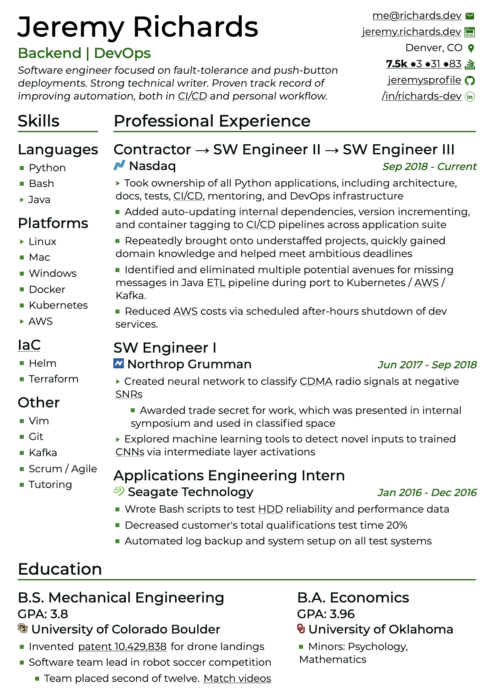
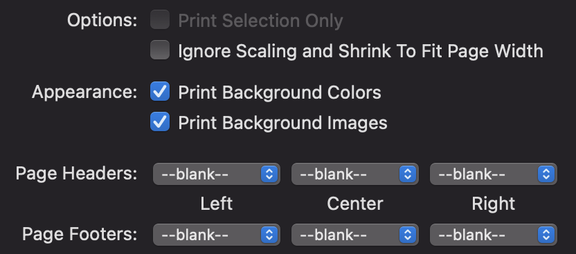
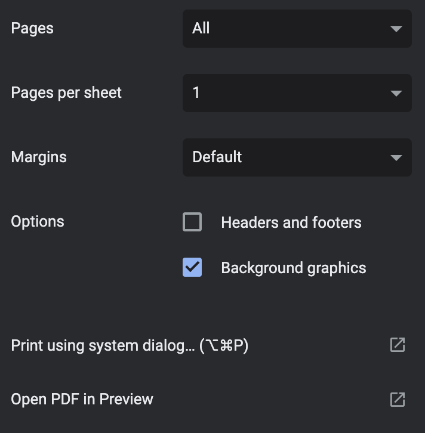

# Resume Builder
I made a resume layout.

You're welcome to use it!

## What's it look like?


[Link to my resume](https://jeremy.richards.dev/cv/)

## How do I use it?
### Add your content
Add your content to the [`cv.md`](./docs/cv.md) file.
TODO.
### View your content
#### Install pre-reqs
You need Python3 and `pip`.
```bash
pip install -U mkdocs jinja2
```
#### Serve content
```bash
mkdocs serve
```
It auto-reloads when you save changes to any of the relevant files.

### Edit the layout
Don't like the colors? Change then in [`./layout/css/cv.css`](./layout/css/cv.css).

Don't like the font? Just grep for all the instances of `Montserrat` and replace the name and source with your choice (namely [`./layout/css/cv.css`](./layout/css/cv.css) and [`./layout/cv.html`](./layout/cv.html)).

### Save your content as a PDF
In your browser, just print to PDF. **Make sure you turn off any page headers/footers and turn on printing background colors and images.**




#### Publish your content to your site
##### Create as the only content on your static site
1. Fork this repo to `<USERNAME>.github.io`.
2. Turn on GitHub Pages by going to Settings and then Pages.
3. If you have a custom domain, set up a CNAME record in your domain's DNS records to point to `<USERNAME>.github.io` and create `./docs/CNAME` with your custom domain as the only content.
4. Test! Access your site via `<USERNAME>.github.io`, via your custom domain (e.g., `jeremy.richards.dev`) and via your domain with the `cv/` suffix (e.g., `jeremy.richards.dev/cv/`). Note that your DNS records may take up to 48 hours to be available.

This will set up your custom domain to redirect `/` to `/cv/`. If you do not want this behavior, you'll have to edit `./layout/main.html`.

##### Add to your MkDocs static site
If you already use `MkDocs`, you can add your resume to your site by copying the [`cv/`](./docs/cv/) directory, its contents, and [`cv.md`](./docs/cv.md) from [`./docs`](./docs/) to the content directory of your site.
Also copy [`./layout/cv.html`](./layout/cv.html) and [`./layout/css/cv.css`](./layout/css/cv.css) to the layout directory of your site.

##### Add the raw HTML pages to your site
Copy the relevant directories (I would suggest `css/` and `cv/`) from `./site` after `mkdocs build` to whereever your site serves content from.
